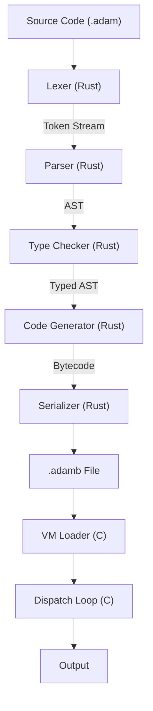

# Architecture Overview

Adam is implemented as a four-stage compilation pipeline: source code is tokenized, parsed into an AST, type-checked, and compiled to bytecode. A separate virtual machine executes the bytecode.

## Compilation Pipeline



## Components

### Compiler (Rust)

The compiler is a single-pass pipeline from source to bytecode:

- **Lexer** (`lexer.rs`): Tokenizes source into a stream of tokens with span information for error reporting. Handles all Adam literals, operators, and keywords.
- **Parser** (`parser.rs`): Pratt parser for expressions (precedence climbing handles operator priority and associativity) combined with recursive descent for statements and declarations. Produces a concrete AST.
- **Type Checker** (`types.rs`): Implements Hindley-Milner type inference via Algorithm W. Uses union-find for type variable substitution, supports let-polymorphism (generalization and instantiation), and performs occurs-check to prevent infinite types.
- **Code Generator** (`compiler.rs`): Walks the AST and emits stack-based bytecode. Handles local variable resolution, upvalue capture for closures, constant folding, and control flow linearization (if/else to jumps, loops to backward jumps).
- **Bytecode** (`bytecode.rs`): Defines the instruction set and binary serialization format. The `.adamb` format consists of a magic number, version byte, constant pool, and code section.

CLI commands: `adamc lex`, `adamc parse`, `adamc check`, `adamc compile`.

### Virtual Machine (C)

A stack-based bytecode interpreter optimized for throughput:

- **Value Representation** (`value.c`): NaN boxing encodes all values (ints, floats, booleans, nil, object pointers) in a single 64-bit word. See [VM Internals](vm-internals.md) for the bit layout.
- **Dispatch Loop** (`vm.c`): Uses computed goto (GCC/Clang `&&label` extension) for the instruction dispatch loop, with a switch-case fallback for other compilers.
- **Garbage Collector** (`gc.c`): Tri-color mark-and-sweep collector. Objects are white (unmarked), gray (marked but children unvisited), or black (fully traced). Collection is triggered when allocation exceeds a threshold.
- **Hash Table** (`table.c`): Open-addressing table with Robin Hood hashing and FNV-1a hash function. Used for global variables and string interning.
- **Objects** (`object.c`): Heap-allocated types include strings (interned), closures, upvalues, and arrays. All objects are linked into a list for GC traversal.

### Tooling (Python)

Python orchestrates the Rust compiler and C VM as subprocesses:

- **Runner** (`runner.py`): CLI that compiles `.adam` to `.adamb` via `adamc compile`, then executes via `adam_vm`. Commands: `adam run`, `adam compile`, `adam check`.
- **REPL** (`repl.py`): Interactive read-eval-print loop using prompt_toolkit with syntax highlighting (custom Pygments lexer) and multiline input.
- **Test Runner** (`test_runner.py`): Runs `.adam` files and verifies output against inline `// expect:` comments or snapshot files.
- **Benchmarks** (`benchmark.py`): Compiles once and runs N iterations, collecting timing statistics (mean, median, min, max, stddev).

### Editor Support (TypeScript)

- **LSP Server** (`tools/lsp/`): Language Server Protocol implementation providing diagnostics (invokes `adamc check`), keyword/builtin completion, hover documentation, and document symbols.
- **Playground** (`tools/playground/`): Browser-based editor using Monaco with a tree-walking TypeScript interpreter for immediate feedback. Includes curated examples and Adam syntax highlighting.
- **TextMate Grammar** (`tools/syntax/`): Syntax highlighting definitions for editors that support TextMate grammars.

## Data Flow

```
                    Rust                          C
              ┌─────────────────┐        ┌──────────────┐
Source.adam →  │ Lexer → Parser  │        │              │
              │   → TypeCheck   │        │  VM Loader   │
              │   → Codegen     │  .adamb│  → Dispatch  │ → stdout
              │   → Serialize   │ ──────>│  → GC        │
              └─────────────────┘        └──────────────┘
                                               ↑
                    Python                     │
              ┌─────────────────┐              │
              │ Runner / REPL   │──────────────┘
              │ (orchestrator)  │   invokes both
              └─────────────────┘
```
